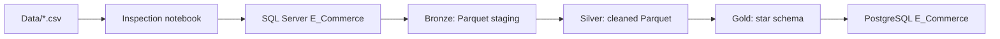

# Olist Brazilian E-Commerce Data Warehouse

A local PySpark data engineering project that transforms the Olist Brazilian e-commerce dataset into a layered warehouse model. The pipeline follows a medallion architecture:



## Project stages

### 1. Data inspection

[`data_inspection.ipynb`](data_inspection.ipynb) loads the raw CSV files with Spark, prints schemas, and displays sample records. Use it to understand table grain, identifiers, timestamps, measures, and relationships before running the pipeline.

### 2. Bronze ingestion

[`Bronze/notebook.ipynb`](Bronze/notebook.ipynb) reads the source tables from SQL Server through JDBC and writes source-preserving Parquet datasets to `Bronze/staging`. It also compares source and staged row counts.

### 3. Silver cleaning

[`Silver/notebook.ipynb`](Silver/notebook.ipynb) reads Bronze Parquet data, standardizes selected types, removes duplicate customers and orders, parses timestamps, and runs basic quality checks. The cleaned datasets are written to `Silver/silver`.

### 4. Gold modeling

[`Gold/notebook.ipynb`](Gold/notebook.ipynb) creates a dimensional model from Silver data and publishes it to PostgreSQL:

| Table | Purpose |
| --- | --- |
| `dim_customer` | Customer attributes and averaged geolocation |
| `dim_seller` | Seller attributes and averaged geolocation |
| `dim_product` | Product identifiers and translated categories |
| `dim_date` | Purchase dates, weekday labels, and weekend flags |
| `fact_orders` | Order, item, payment, and review measures with dimension keys |

## SCD process

The project includes a dedicated Slowly Changing Dimension (SCD) workflow under [`SCD/`](SCD). This pattern is used to manage dimension changes over time for customer data in the warehouse without losing historical context.

The process is:

1. `staging.sql` creates a temporary `stg_customer_updates` table and loads a small sample of current customer rows from `dim_customer`.
2. `cdc_detection.sql` compares the staged data with the active dimension row to detect attribute changes, such as a city or state update.
3. `scd_type_1.sql` applies overwrite logic for attributes that should reflect the latest value only.
4. `scd_type_2.sql` keeps the old record as history, closes the active row with a `valid_to` timestamp, and inserts a new current record with a new validity period.

This pattern is useful when a business dimension like customer address changes over time. Type 1 is used for non-historical overwrite behavior, while Type 2 preserves history for auditability and trend analysis.

## Repository layout

```text
.
├── Data/                    Raw Olist CSV files
├── data_inspection.ipynb    Source data exploration
├── Bronze/
│   ├── notebook.ipynb       SQL Server to Parquet ingestion
│   └── staging/             Bronze Parquet output
├── Silver/
│   ├── notebook.ipynb       Cleaning and quality checks
│   └── silver/              Silver Parquet output
├── Gold/
│   └── notebook.ipynb       Dimensional model and PostgreSQL publishing
├── SCD/
│   ├── staging.sql          Creates a staging table for incoming customer changes
│   ├── cdc_detection.sql    Detects differences between staged and current rows
│   ├── scd_type_1.sql       Overwrites the newest value for Type 1 change handling
│   └── scd_type_2.sql       Closes prior row and creates a new historical version
├── ERD.pgerd                PostgreSQL/pgAdmin ERD definition
```

## Prerequisites

- Windows with Java, PySpark, and Jupyter support configured.
- Apache Spark with a local master.
- SQL Server running locally on port `1433`, with the `E_Commerce` database and source tables in the `dbo` schema.
- PostgreSQL running locally with an `E_Commerce` database.
- JDBC drivers available at the paths referenced by the notebooks:
  - `C:\spark_jar\mssql-jdbc-13.4.0.jre11.jar`
  - `C:\spark_jar\postgresql-42.7.13.jar`
- A Python environment with `pyspark` installed.

The notebooks currently reference a local Java installation under `C:\Program Files\Eclipse Adoptium`. Update those paths for your machine.

## Run order

1. Open and run `data_inspection.ipynb` to inspect the raw CSV inputs.
2. Run `Bronze/notebook.ipynb` to populate `Bronze/staging` from SQL Server.
3. Run `Silver/notebook.ipynb` to populate `Silver/silver`.
4. Run `Gold/notebook.ipynb` to build and publish the warehouse tables to PostgreSQL.

Run notebooks from their own directories when relative paths matter, or adjust the paths to match the active workspace directory.

## Configuration and security

The notebooks are written for a local development environment and currently contain local database connection details, JDBC driver paths, and authentication settings. Before sharing or deploying the project:

- Move usernames and passwords to environment variables or a secrets manager.
- Avoid committing real credentials to source control.
- Replace hard-coded Windows paths with configuration values.
- Use a least-privilege database account for pipeline writes.

The Gold notebook uses overwrite mode when publishing tables, so rerunning it replaces the existing Gold tables.

## Data quality notes

The Silver notebook reports null counts and checks for impossible delivery dates, negative prices or payments, and review scores outside the expected 1-5 range. These checks currently report issues for inspection; they do not reject or quarantine invalid rows automatically.

The Gold model uses generated surrogate keys via Spark `monotonically_increasing_id()`. These keys are suitable for the current local build but are not stable identifiers across complete rebuilds.
