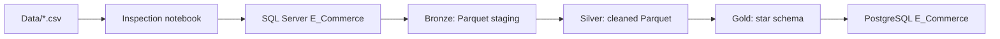

# Olist Brazilian E-Commerce Data Warehouse

A local PySpark data engineering project that transforms the Olist Brazilian e-commerce dataset into a layered warehouse model. The pipeline follows a medallion architecture:



## Project stages

### 1. Data inspection

[`data_inspection.ipynb`](data_inspection.ipynb) loads the raw CSV files with Spark, prints schemas, and displays sample records. Use it to understand table grain, identifiers, timestamps, measures, and relationships before running the pipeline.

### 2. Bronze ingestion

[`Bronze/notebook.ipynb`](Bronze/notebook.ipynb) reads the source tables from SQL Server through JDBC and writes source-preserving Parquet datasets to `Bronze/staging`. It also compares source and staged row counts.

### 3. Silver cleaning

[`Silver/notebook.ipynb`](Silver/notebook.ipynb) reads Bronze Parquet data, standardizes selected types, removes duplicate customers and orders, parses timestamps, and runs basic quality checks. The cleaned datasets are written to `Silver/silver`.

### 4. Gold modeling

[`Gold/notebook.ipynb`](Gold/notebook.ipynb) creates a dimensional model from Silver data and publishes it to PostgreSQL:

| Table | Purpose |
| --- | --- |
| `dim_customer` | Customer attributes and averaged geolocation |
| `dim_seller` | Seller attributes and averaged geolocation |
| `dim_product` | Product identifiers and translated categories |
| `dim_date` | Purchase dates, weekday labels, and weekend flags |
| `fact_orders` | Order, item, payment, and review measures with dimension keys |

# SCD & CDC — Olist Gold Layer

SQL scripts implementing Change Data Capture and Slowly Changing Dimension
handling on top of the `dim_customer` table in the Gold-layer star schema.

## Run order

1. `01_staging_setup.sql` — builds/refreshes `stg_customer_updates`, a
staging table simulating incoming source data.
2. `02_cdc_detection.sql` — compares staging against the live dimension
table and returns only the rows that actually changed.
3. `03_scd_type1.sql` — applies a detected change as a destructive
overwrite. Use when history doesn't matter (e.g. a typo correction).
4. `04_scd_type2.sql` — applies a detected change as a new versioned row,
preserving the old one. Use when the change is a real historical fact
(e.g. a customer relocating).

`reset_constraints.sql` / `restore_constraints.sql` are separate, general
purpose scripts for the Gold layer as a whole — run `reset` before any
Spark `mode("overwrite")` write to the dimension/fact tables, `restore`
after.

## A real lesson from building this

Type 1 and Type 2 aren't interchangeable after the fact. During
development, Type 1 was applied to a customer's city change first; when
Type 2 logic was later applied to the *same* customer, there was nothing
left to preserve — the old value was already gone. The choice between
Type 1 and Type 2 has to be made **before** a change is applied, since
Type 1 is irreversible and destroys the history Type 2 depends on.

Re-running the Type 2 exercise on a customer that hadn't been touched by
Type 1 produced the correct result: two rows, the old value closed out
with a real `valid_to` date, the new value marked `is_current = TRUE`. 

## Repository layout

```text
.
├── Data/                    Raw Olist CSV files
├── data_inspection.ipynb    Source data exploration
├── Bronze/
│   ├── notebook.ipynb       SQL Server to Parquet ingestion
│   └── staging/             Bronze Parquet output
├── Silver/
│   ├── notebook.ipynb       Cleaning and quality checks
│   └── silver/              Silver Parquet output
├── Gold/
│   └── notebook.ipynb       Dimensional model and PostgreSQL publishing
├── SCD/
│   ├── staging.sql          Creates a staging table for incoming customer changes
│   ├── cdc_detection.sql    Detects differences between staged and current rows
│   ├── scd_type_1.sql       Overwrites the newest value for Type 1 change handling
│   └── scd_type_2.sql       Closes prior row and creates a new historical version
├── ERD.pgerd                PostgreSQL/pgAdmin ERD definition
```

## Prerequisites

- Windows with Java, PySpark, and Jupyter support configured.
- Apache Spark with a local master.
- SQL Server running locally on port `1433`, with the `E_Commerce` database and source tables in the `dbo` schema.
- PostgreSQL running locally with an `E_Commerce` database.
- JDBC drivers available at the paths referenced by the notebooks:
  - `C:\spark_jar\mssql-jdbc-13.4.0.jre11.jar`
  - `C:\spark_jar\postgresql-42.7.13.jar`
- A Python environment with `pyspark` installed.

The notebooks currently reference a local Java installation under `C:\Program Files\Eclipse Adoptium`. Update those paths for your machine.

## Run order

1. Open and run `data_inspection.ipynb` to inspect the raw CSV inputs.
2. Run `Bronze/notebook.ipynb` to populate `Bronze/staging` from SQL Server.
3. Run `Silver/notebook.ipynb` to populate `Silver/silver`.
4. Run `Gold/notebook.ipynb` to build and publish the warehouse tables to PostgreSQL.

Run notebooks from their own directories when relative paths matter, or adjust the paths to match the active workspace directory.

## Configuration and security

The notebooks are written for a local development environment and currently contain local database connection details, JDBC driver paths, and authentication settings. Before sharing or deploying the project:

- Move usernames and passwords to environment variables or a secrets manager.
- Avoid committing real credentials to source control.
- Replace hard-coded Windows paths with configuration values.
- Use a least-privilege database account for pipeline writes.

The Gold notebook uses overwrite mode when publishing tables, so rerunning it replaces the existing Gold tables.

## Data quality notes

The Silver notebook reports null counts and checks for impossible delivery dates, negative prices or payments, and review scores outside the expected 1-5 range. These checks currently report issues for inspection; they do not reject or quarantine invalid rows automatically.

The Gold model uses generated surrogate keys via Spark `monotonically_increasing_id()`. These keys are suitable for the current local build but are not stable identifiers across complete rebuilds.

## Surrogate Key Generation: `monotonically_increasing_id()` vs `row_number()`

### The bug

Every dimension table in the Gold layer needs a surrogate key — an internal integer ID that the fact table references, separate from the natural key (`customer_id`, `seller_id`, etc.) that comes from the source data. The first version of this pipeline generated those keys like this:

```python
dim_customer = customers_silver.select(
    "customer_id", "customer_unique_id", "customer_city", "customer_state"
).dropDuplicates(["customer_id"]) \
 .withColumn("customer_key", F.monotonically_increasing_id())
```

This looked correct, ran without error, and produced a table with what appeared to be a clean auto-incrementing key column. Adding the primary key constraint in Postgres also succeeded:

```sql
ALTER TABLE dim_customer ADD PRIMARY KEY (customer_key);
```

The problem only surfaced later, when adding the foreign key on the fact table:

```sql
ALTER TABLE fact_orders ADD CONSTRAINT fk_customer
    FOREIGN KEY (customer_key) REFERENCES dim_customer(customer_key);
```

```text
ERROR:  insert or update on table "fact_orders" violates foreign key constraint "fk_customer"
Key (customer_key)=(77309412371) is not present in table "dim_customer".
```

A direct count of orphaned rows confirmed the scale of the problem — not a handful of edge cases, but a systemic mismatch:

```sql
SELECT COUNT(*) FROM fact_orders f
LEFT JOIN dim_customer c ON f.customer_key = c.customer_key
WHERE c.customer_key IS NULL;
```

`51,951` orphaned rows out of ~118,000 — the surrogate keys referenced in `fact_orders` genuinely did not match the keys stored in `dim_customer`, despite both being built from the same underlying data.

### Why it happened

`F.monotonically_increasing_id()` generates values based on Spark's partition structure at the moment it is evaluated — it is not a value that gets computed once and frozen. Because Spark uses lazy evaluation, a DataFrame's transformations can be re-executed from scratch any time the DataFrame is used again — including implicitly, as part of a later join. `dim_customer` was built once with one set of IDs, written to Postgres, and then re-used (via a fresh read, or a re-triggered lazy computation) when `fact_orders` was built by joining against it. Spark re-ran the ID generation during that later use, and `monotonically_increasing_id()` is not guaranteed to reproduce the same values on a second evaluation — so the fact table's foreign keys ended up referencing IDs that no longer matched what was actually written to `dim_customer`.

### The fix

Two changes, used together:

1. `row_number()` over an explicit ordering, instead of `monotonically_increasing_id()`. Deterministic and reproducible for a given input ordering, rather than tied to partition layout.
2. `.cache()` plus an eager action (`.count()`), forcing Spark to materialize the DataFrame once and hold it in memory, so every downstream use of it — including the join that builds `fact_orders` — reads the same frozen set of keys instead of potentially re-triggering the key-generation logic.

```python
from pyspark.sql.window import Window

window = Window.orderBy("customer_id")

dim_customer = customers_silver.select(
    "customer_id", "customer_unique_id", "customer_city", "customer_state"
).dropDuplicates(["customer_id"]) \
 .withColumn("customer_key", F.row_number().over(window))

dim_customer.cache()
dim_customer.count()   # forces materialization now, not lazily later
```

`fact_orders` was then rebuilt joining against this exact cached DataFrame object, within the same notebook run, and both were rewritten to Postgres. The foreign key constraint then applied cleanly, with zero orphaned rows.

### The lesson

`monotonically_increasing_id()` is safe within a single, unbroken computation, but not safe as a durable key across separate reads, re-evaluations, or writes — which is exactly the situation a multi-step Gold-layer build creates. `row_number()` with an explicit `.cache()` is the reliable pattern for surrogate keys that need to stay consistent across a join to a fact table and a subsequent write to a database.
